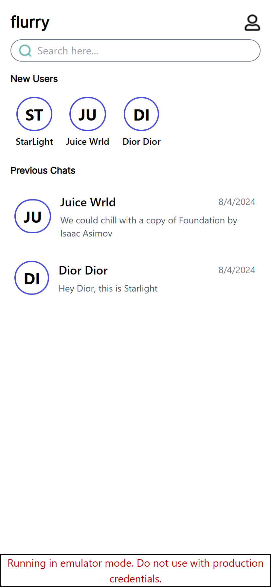
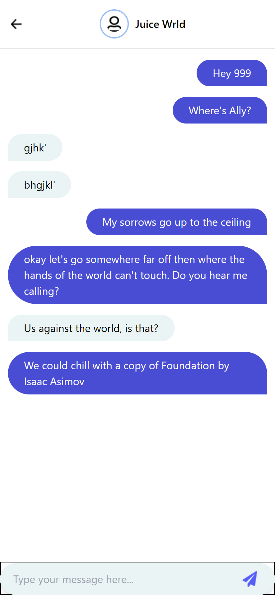

# Flurry

A Telegram meets WhatsApp social media platform built with Firebase, React and TailwindCSS. Site deployed live at https://flurry-chat.web.app.

## Technologies

* React
* Firebase
* TailwindCSS
* Framer Motion

## Screenshots

<br>
<br>
<br>



## Setup
* Clone the repository with ```git clone https://github.com/mighty-odewumi/flurry-chat```
* Run ```npm install```.
* Run ```npm run dev``` to start up the server.
* Run ```firebase emulators:start``` if you desire to run tests offline with the ```Firebase emulators```.


## Achievements
+ [x] Created a splash screen.
+ [x] Created signin and signup pages.
+ [x] Successfully implemented sending and receiving data stored in Firestore.
+ [x] Create a page to display list of available users.
+ [x] On the same page, display list of past chats or previous conversations. 
+ [x] Improved the UI of the DMs.

## Todo

+ [ ] Improve UI for conversation listing.
+ [ ] Enable responsiveness.
+ [ ] Show unread messages count.
+ [ ] Push notifications.
+ [ ] Recreate database to enable scalability.  
  