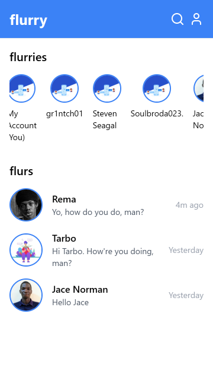
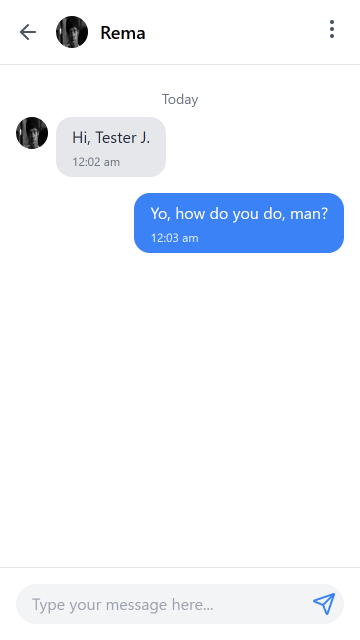

# Flurry

A Messenger meets WhatsApp social media platform built with Firebase, React and TailwindCSS. Site deployed live at https://flurry-chat.web.app.

## Technologies

* React
* Firebase
* TailwindCSS
* Framer Motion
* Supabase

## Screenshots

<br>
<br>
<br>



## Setup
* Clone the repository with ```git clone https://github.com/mighty-odewumi/flurry-chat```
* Run ```npm install```.
* Go to Google Firebase Console to create a project and copy setup code and configs.
### FIREBASE
* Create a ```.env``` file with your firebase details saving them as:
  1. ```VITE_FIREBASE_API_KEY```, 
  2. ```VITE_FIREBASE_APP_ID```,
  3. ```VITE_FIREBASE_STORAGE_BUCKET```
  4. ```VITE_FIREBASE_AUTH_DOMAIN```
  5. ```VITE_FIREBASE_PROJECT_ID```
  6. ```VITE_FIREBASE_MESSAGING_SENDER_ID```
  7. ```VITE_FIREBASE_MEASUREMENT_ID```
  8. ```VITE_GOOGLE_APPLICATION_CREDENTIALS```
* The ```config.js``` already handles the fetching of those details and makes the config available for import by other modules.

### SUPABASE
* Also, obtain API credentials from [Supabase](https://supabase.com) by creating a project.
* This API key is saved in your ```.env``` as ```VITE_SUPABASE_KEY```.
* Bucket URL is stored as ```VITE_SUPABASE_BUCKET```.

----

* Run ```npm run dev``` to start up the server.
* To run tests offline, configure Firebase locally with Firebase tools SDK. Details of this can be gotten online.
* Run ```firebase emulators:start``` to use with the ```Firebase emulators```.
* After a change, run ```npm run build``` to build your project and ```firebase deploy``` to deploy to firebase hosting provider.


## Achievements
+ [x] Created a splash screen.
+ [x] Created signin and signup pages.
+ [x] Successfully implemented sending and receiving data stored in Firestore.
+ [x] Create a page to display list of available users.
+ [x] On the same page, display list of past chats or previous conversations. 
+ [x] Improved the UI of the DMs.

## Todo

+ [ ] Enable responsiveness on larger screens.
+ [ ] Show unread messages count.
+ [ ] Push notifications.
  